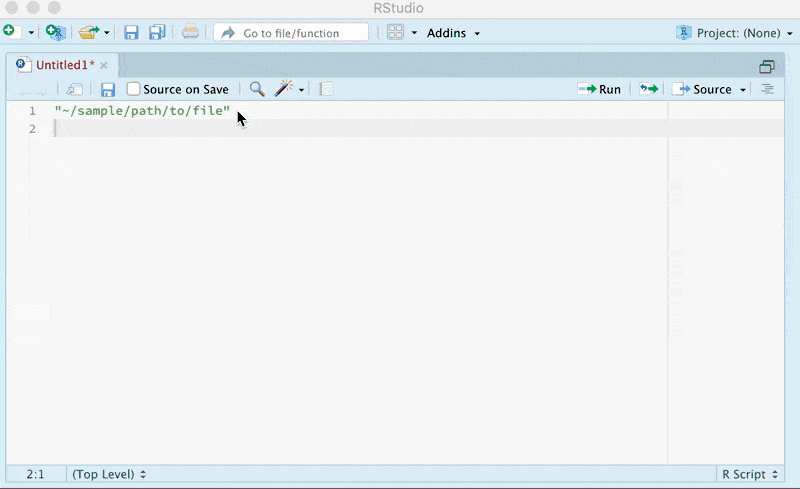

# reformatFilePath

[](https://travis-ci.org/konradzdeb/reformatFilePath)   [](https://ci.appveyor.com/project/konradzdeb/reformatFilePath) [](https://codecov.io/gh/konradzdeb/reformatFilePath)

The `reformatFilePath` RStudio Addin provides convenient mechanism replacing path string with a `file.path` call. 

## Installation

The package can be installed from GitHub using [`devtools`](https://devtools.r-lib.org) or [`remotes`](https://github.com/r-lib/remotes) package. Installation using [`devtools`](https://devtools.r-lib.org):

``` r 
if (!require("devtools")) {
    install.packages("devtools")
    devtools::install_github('konradedgar/reformatFilePath')
} else {
    devtools::install_github('konradedgar/reformatFilePath')
}
```

## Example



